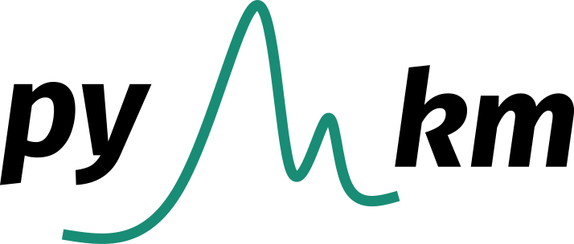

[](https://opensource.org/licenses/MIT)
[](http://dx.doi.org/10.1039/D3DD00163F)


<div style="display: flex; justify-content: center; align-items: center;">
    <p align="center">
     
    </p>
</div>


Pymkm is a software for building microkinetic models for heterogeneous catalytic applications.

- Thermal catalysis: Steady-state reaction rates, surface coverage, apparent activation energy and reaction orders, degree of rate control and reversibility analysis.
- Electro-catalysis: Steady-state current density, Tafel plots.

## Usage

To run microkinetic models with pymkm, two input plain text files are required: `rm.mkm`, listing the global and elementary reactions defining the system under study, and `g.mkm` providing the energy of the intermediates and activation barrier of the elementary reactions, values typically obtained with density functional theory (DFT). Examples of input files structure and definition can be found in the `examples` folder. Once defined, a microkinetic model can be instantiated:

```python
from pymkm import MicrokineticModel

mkm = MicrokineticModel('case_study_name', 'rm.mkm', 'g.mkm')
```

To run a simulation at specific operating conditions of temperature, pressure and inlet gas composition:

```python
T = 573  # K
P = 20E5  # Pa 
yin = [0.8,0.2,0,0,0]  # molar fractions of the gas-phase input
run = mkm.kinetic_run(T, P, yin)
```

The default reactor model is a zero-conversion differential reactor `DifferentialPFR` model, which provides as output the steady-state surface coverages, reaction rates and selectivity. This reactor model can be used additionally to get apparent activation energy and reaction orders. To get more quantitative information such as conversion and yield, the `DynamicCSTR` model is available, but this requires providing information as volume, inlet flow rate, catalyst mass, etc.

## License
Pymkm is released under the [MIT](./LICENSE) License.

## Author
Santiago Morandi (ICIQ)

## Contributors
Albert Sabadell-Rendon (ICIQ), Ranga Rohit Seemakurthi (ICIQ)

## References

<div style="border: 1px solid #ccc; padding: 10px;">
  
- [Automated MUltiscale simulation environment](http://dx.doi.org/10.1039/D3DD00163F)
  - **Authors:** Albert Sabadell-Rendón, Kamila Kaźmierczak, Santiago Morandi, Florian Euzenat, Daniel Curulla-Ferré, Núria López
  - **Journal:** Digital Discovery
  - **Year:** 2023
  - **Volume:** 2
  - **Issue:** 6
  - **Pages:** 1721-1732
  - **Publisher:** RSC
  - **DOI:** 10.1039/D3DD00163F

</div>


